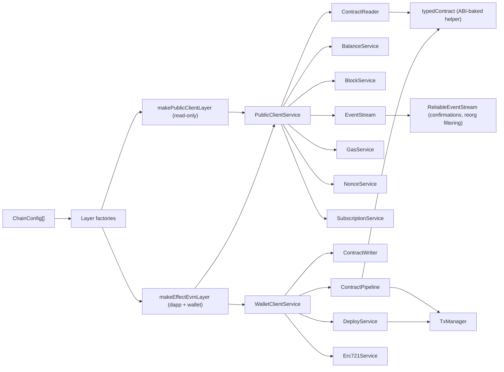

# effect-evm-v4 usage

Type-safe, composable EVM services for [Effect](https://effect.website), built on [viem](https://viem.sh).

## High-level flow

1. Configure chain RPCs (`ChainConfig[]`)
2. Provide a Layer (`makeEffectEvmLayer` for dapps, or `makePublicClientLayer` for read-only) + any optional service
   layers
3. Read via `ContractReader` (or `typedContract`) and higher-level helpers like `BalanceService`
4. Write via `ContractPipeline` (preflight -> send -> wait -> decode), or dedicated services like `DeployService`
5. Stream/decode events via `EventStream` (or `ReliableEventStream` for confirmations), or raw watchers via
   `SubscriptionService`
6. In tests, use `effect-evm-v4/testing-kit`



## Optional service layers

`makeEffectEvmLayer` wires the core contract / tx / event services. Add the newer service modules by merging their
`*Live` layers.

```typescript
import { Layer } from "effect";
import {
  BalanceServiceLive,
  BlockServiceLive,
  DeployServiceLive,
  Erc721ServiceLive,
  GasServiceLive,
  NonceServiceLive,
  SignatureServiceLive,
  SimulationServiceLive,
  SubscriptionServiceLive,
  makeEffectEvmLayer,
} from "effect-evm-v4";

// configs: ChainConfig[] (see Quick Start)
// provider: EIP-1193 (e.g. window.ethereum)
const provider = window.ethereum;
const BaseLayer = makeEffectEvmLayer(configs, provider);

export const EvmLayer = Layer.provideMerge(
  Layer.mergeAll(
    BalanceServiceLive,
    BlockServiceLive,
    GasServiceLive,
    NonceServiceLive,
    SignatureServiceLive,
    SubscriptionServiceLive,
    DeployServiceLive,
    Erc721ServiceLive,
    SimulationServiceLive,
  ),
  BaseLayer,
);
```

Notes:

- Public-client only: `BalanceService`, `BlockService`, `GasService`, `NonceService`, `SubscriptionService`
- Wallet required: `ContractWriter`, `ContractPipeline`, `DeployService`, `Erc721Service`
- No chain clients: `SignatureService`
- Tenderly: `SimulationService` (requires env vars below)

## Installation

```bash
bun add effect-evm-v4
```

**Peer dependencies**

- `effect@^4.0.0-beta.102`
- `viem@^2.43`
- Optional: `@wagmi/core@>=2.0.0` (for `effect-evm-v4/wagmi`)
- Optional: `react@>=18.2.0`, `react-dom@>=18.2.0` (for `effect-evm-v4/react-hooks`)
- Optional: `vitest@>=4.1.0` (for assertion helpers in `effect-evm-v4/testing-kit`)

## Quick Start

```typescript
import { Effect } from "effect";
import { mainnet } from "viem/chains";
import { ContractReader, erc20Abi, makeEffectEvmLayer, type ChainConfig } from "effect-evm-v4";

// 1. Configure chains
const configs: ChainConfig[] = [{ chainId: 1, chain: mainnet, rpcUrls: ["https://rpc.example"] }];

// 2. Create the layer (provider is your EIP-1193 wallet)
const EvmLayer = makeEffectEvmLayer(configs, window.ethereum);

// 3. Use services
const program = Effect.gen(function* () {
  const reader = yield* ContractReader;

  const balance = yield* reader.read({
    chainId: 1,
    address: "0xA0b86991c6218b36c1d19D4a2e9Eb0cE3606eB48", // USDC
    abi: erc20Abi,
    functionName: "balanceOf",
    args: ["0x..."],
  });

  return balance;
});

// 4. Run
Effect.runPromise(program.pipe(Effect.provide(EvmLayer)));
```

## ChainConfig

`makePublicClientLayer` / `makeEffectEvmLayer` take `ChainConfig[]`.

```ts
export type ChainConfig = {
  chainId: number;
  chain: Chain;
  rpcUrls: string[]; // HTTP fallback order
  wsUrls?: string[]; // optional; used for subscriptions when present
  http?: { retryCount?: number; retryDelay?: number; timeout?: number };
  ws?: { retryCount?: number; retryDelay?: number; timeout?: number; keepAlive?: boolean; reconnect?: boolean };
  rpcMiddleware?: {
    retry?: { retryCount?: number; retryDelay?: number; timeout?: number };
    circuitBreaker?: { failureThreshold?: number; resetTimeoutMs?: number };
    dedup?: boolean;
  };
  transport?: Transport; // escape hatch; takes precedence
};
```

**Migration note**: old `{ rpcUrl: "..." }` becomes `{ rpcUrls: ["..."] }`.

**Recommended production config (example)**

```ts
const configs: ChainConfig[] = [
  {
    chainId: 1,
    chain: mainnet,
    rpcUrls: ["https://rpc1.example", "https://rpc2.example"],
    wsUrls: ["wss://ws1.example"],
    rpcMiddleware: {
      retry: { retryCount: 3, retryDelay: 150, timeout: 10_000 },
      circuitBreaker: { failureThreshold: 5, resetTimeoutMs: 15_000 },
      dedup: true,
    },
  },
];
```

## Using wagmi v2

If your app already uses wagmi v2 for wallet connections and chain config, you can build effect-evm-v4 layers directly
from your wagmi `config`.

```typescript
import { Effect } from "effect";
import { createConfig, http } from "wagmi";
import { mainnet, sepolia } from "wagmi/chains";
import { injected } from "wagmi/connectors";
import { makeEffectEvmLayerFromWagmi } from "effect-evm-v4/wagmi";

export const wagmiConfig = createConfig({
  chains: [mainnet, sepolia],
  connectors: [injected()],
  transports: {
    [mainnet.id]: http("https://mainnet.example.com"),
    [sepolia.id]: http("https://sepolia.example.com"),
  },
});

const EvmLayer = makeEffectEvmLayerFromWagmi(wagmiConfig);

// Use services as usual
Effect.runPromise(program.pipe(Effect.provide(EvmLayer)));
```

## React Hooks

The `effect-evm-v4/react-hooks` module provides React integration for effect-evm-v4 services.

### Provider setup

Wrap your app with `EffectEvmProvider` to provide the Effect runtime:

```typescript
import { EffectEvmProvider } from "effect-evm-v4/react-hooks";
import { makeEffectEvmLayer } from "effect-evm-v4";

const EvmLayer = makeEffectEvmLayer(configs, window.ethereum);

function App() {
  return (
    <EffectEvmProvider layer={EvmLayer}>
      <YourApp />
    </EffectEvmProvider>
  );
}
```

### Safe App vs Safe multisig

Use Safe App hooks to detect the host iframe context, and Safe multisig hooks to detect the connected wallet.

- Safe App context (SDK): `useIsSafeAppContext`
- Safe App host (SDK + origin): `useIsHostSafeApp`
- Safe multisig wallet (SDK + connector + host): `useIsSafeMultisigWallet`

Safe App origin utilities let you control the allowed host list:

- `DEFAULT_SAFE_APP_ORIGINS`
- `getSafeAppOrigins`, `setSafeAppOrigins`, `extendSafeAppOrigins`, `subscribeSafeAppOrigins`

### Primitive hooks

Low-level hooks for running Effects and Streams in React:

```typescript
import { useEffectOnce, useEffectMemo, useStream, useSubscriptionRef } from "effect-evm-v4/react-hooks";

// Run an Effect once on mount
const { data, error, status } = useEffectOnce(() => someEffect);

// Run an Effect when dependencies change (memoized)
const { data, error, status } = useEffectMemo(() => someEffect, [dep1, dep2]);

// Subscribe to an Effect Stream
const { status, value, error } = useStream(someStream);

// Subscribe to an Effect SubscriptionRef
const value = useSubscriptionRef(subscriptionRef);
```

### Convenience hooks

Higher-level hooks for common contract operations:

```typescript
import { useContractRead, useWatchContractRead, useWriteAndTrack } from "effect-evm-v4/react-hooks/convenience";

// Read a contract value (cached via ContractQuery)
const { data, error, status } = useContractRead({
  chainId: 1,
  address: tokenAddress,
  abi: erc20Abi,
  functionName: "balanceOf",
  args: [userAddress],
});

// Watch a contract value (re-fetches on new blocks)
const { status, value, error } = useWatchContractRead({
  chainId: 1,
  address: tokenAddress,
  abi: erc20Abi,
  functionName: "totalSupply",
});

// Write with reactive transaction state
const { send, state, terminal, actions } = useWriteAndTrack({
  chainId: 1,
  address: tokenAddress,
  abi: erc20Abi,
  functionName: "transfer",
  args: [recipient, amount],
  account: userAddress,
});

// state contains: { status, hash, receipt, ... }
// actions contains: { cancel, speedup }
```

### Wagmi + React integration

For apps using wagmi, use `WagmiEffectEvmProvider` which syncs wallet state automatically:

```typescript
import { WagmiEffectEvmProvider } from "effect-evm-v4/react-hooks/wagmi";
import { wagmiConfig } from "./wagmi";

function App() {
  return (
    <WagmiEffectEvmProvider wagmiConfig={wagmiConfig}>
      <YourApp />
    </WagmiEffectEvmProvider>
  );
}
```

## Read-only (no wallet)

If you only need reads (e.g. backend jobs), provide `PublicClientService` + `ContractReaderLive` without a wallet
provider.

```typescript
import { Effect, Layer } from "effect";
import { ContractReader, ContractReaderLive, erc20Abi, makePublicClientLayer, type ChainConfig } from "effect-evm-v4";
import { mainnet } from "viem/chains";

const configs: ChainConfig[] = [{ chainId: 1, chain: mainnet, rpcUrls: ["https://rpc.example"] }];
const ReadLayer = Layer.provide(ContractReaderLive, makePublicClientLayer(configs));

const program = Effect.gen(function* () {
  const reader = yield* ContractReader;
  return yield* reader.read({
    chainId: 1,
    address: "0xA0b86991c6218b36c1d19D4a2e9Eb0cE3606eB48", // USDC
    abi: erc20Abi,
    functionName: "symbol",
  });
});

Effect.runPromise(program.pipe(Effect.provide(ReadLayer)));
```

## Reads

Use `ContractReader.read` for single calls and `ContractReader.multicall` to batch.

```typescript
import { Effect } from "effect";
import { ContractReader, erc20Abi, typedContract } from "effect-evm-v4";

const usdc = typedContract(erc20Abi, "0xA0b86991c6218b36c1d19D4a2e9Eb0cE3606eB48");

const program = Effect.gen(function* () {
  const reader = yield* ContractReader;

  const [symbol, decimals] = yield* reader.multicall(1, [
    { address: usdc.address, abi: usdc.abi, functionName: "symbol" },
    { address: usdc.address, abi: usdc.abi, functionName: "decimals" },
  ]);

  const balance = yield* usdc.read(1, "balanceOf", ["0x..."]);

  return { balance, decimals, symbol };
});
```

## Balances

Use `BalanceService` for native and ERC-20 balances (single + batch/multicall) and simple balance streams.

```typescript
import { Effect } from "effect";
import { BalanceService } from "effect-evm-v4";

const program = Effect.gen(function* () {
  const balances = yield* BalanceService;

  const eth = yield* balances.getBalance({ chainId: 1, address: "0x..." });
  const tokens = yield* balances.getTokenBalances({
    chainId: 1,
    address: "0x...",
    tokenAddresses: ["0x...", "0x..."],
  });

  return { eth, tokens };
});
```

## Blocks

Use `BlockService` for block lookups, range fetches, and block streams.

```typescript
import { Effect } from "effect";
import { BlockService } from "effect-evm-v4";

const program = Effect.gen(function* () {
  const blocks = yield* BlockService;

  const blockNumber = yield* blocks.getBlockNumber({ chainId: 1 });
  const timestamp = yield* blocks.getBlockTimestamp({ chainId: 1, blockNumber });

  return { blockNumber, timestamp };
});
```

## Gas

Use `GasService` for EIP-1559 fee estimation and gas limits.

```typescript
import { Effect } from "effect";
import { GasService } from "effect-evm-v4";

const program = Effect.gen(function* () {
  const gas = yield* GasService;
  return yield* gas.estimateFees({ chainId: 1, speed: "fast" });
});
```

## Nonces

Use `NonceService` for local nonce reservation / gap detection when sending multiple transactions.

```typescript
import { Effect } from "effect";
import { NonceService } from "effect-evm-v4";

const program = Effect.gen(function* () {
  const nonces = yield* NonceService;

  const address = "0x..." as const;
  const nonce = yield* nonces.reserve({ chainId: 1, address });

  // ...send tx with `nonce`...

  yield* nonces.confirm({ chainId: 1, address, nonce });
});
```

## Writes

Prefer `ContractPipeline` unless you need low-level control.

```typescript
import { Effect } from "effect";
import { ContractPipeline, erc20Abi } from "effect-evm-v4";

const program = Effect.gen(function* () {
  const pipeline = yield* ContractPipeline;

  const terminal = yield* pipeline.writeAndWait({
    chainId: 1,
    address: tokenAddress,
    abi: erc20Abi,
    functionName: "transfer",
    args: [recipient, amount],
    account: accountAddress,
  });

  if (terminal._tag !== "success") {
    return terminal;
  }

  return terminal.hash;
});
```

`writeAndWait` and `writeAndTrack(...).terminal` now resolve to a terminal union:

- `success` with `{ hash, receipt, events }`
- `queued` with a reference/reason/details payload
- `cancelled` with a reference/reason payload

If you need reactive UI state, use `writeAndTrack` (scoped): it returns a `SubscriptionRef<TxState>` plus an Effect for
the final terminal union.

### Write execution adapters

`ContractPipeline` can delegate the write to a `WriteExecutionAdapter` (for example, the Safe multisig adapter). The
pipeline resolves the adapter from the **call-time context**, so the adapter may be provided anywhere in the final
context — there is no composition-order requirement. Composing it the natural way up (e.g.
`Layer.provideMerge(safeExecutionLayer, baseLayer)`) works; it does not need to sit beneath `ContractPipelineLive`. When
no adapter is present, or its `canHandle` returns `false`, writes fall back to the default EOA path.

### Preflight modes

`ContractPipeline` defaults to strict preflight (`estimate + simulate`, fail on either).

Override per call via `preflight.mode`:

- `strict` (default): safest for create/batch/high-cost writes
- `best-effort`: continue to wallet submission if preflight fails with `GasEstimationError` or `SimulationFailedError`
- `none`: skip preflight entirely, submit directly

`best-effort` only relaxes preflight; submission/receipt/event decoding failures still fail normally.

```typescript
const execution =
  yield *
  pipeline.writeAndTrack({
    chainId: 1,
    address: tokenAddress,
    abi: erc20Abi,
    functionName: "claim",
    args: [claimId],
    account: accountAddress,
    preflight: { mode: "best-effort" }, // "strict" | "best-effort" | "none"
  });

const terminal = yield * execution.terminal;
```

Recommended defaults:

- Keep `strict` for create flows, batches, and high-value transactions.
- Consider `best-effort` for low-complexity withdraw/claim flows where wallet-first UX matters.
- Use `none` sparingly and only when your product explicitly accepts skipping local preflight checks.

### Transaction submission failures

`TransactionSubmissionError` means the wallet/RPC submission failed before a transaction hash was returned, so it is not
a smart-contract revert. The currently supported reason is `raw-transaction-decoding`; the original provider error is
retained as `cause`.

```typescript
const result = pipeline.writeAndWait(params).pipe(
  Effect.catchTag("TransactionSubmissionError", (error) =>
    Effect.succeed({
      _tag: "submission-failed" as const,
      reason: error.reason,
    }),
  ),
);
```

Treat this error as explicitly retryable by the user. The library does not automatically resubmit: a fresh call should
follow a deliberate retry action so the wallet can create a new signature.

## EIP-7702 (EOA delegation + atomic batching)

[EIP-7702](https://eips.ethereum.org/EIPS/eip-7702) adds a new transaction type that lets an EOA "set code" for itself
by including an `authorizationList`. In practice, this enables:

- Atomic batching for EOAs (e.g. `approve` + `swap` in one tx)
- Delegating EOA execution to an implementation contract (smart-account-like UX without deploying a new account)

effect-evm-v4 exposes `Eip7702Service` for the common dapp flow "delegate my EOA to a delegator contract and execute an
ERC-7579 batch".

Requirements / caveats:

- Your chain + wallet must support EIP-7702 (type `0x04`).
- Dapp wallets are usually JSON-RPC accounts, so the wallet is expected to construct/sign the authorization. If you pass
  a local viem account (e.g. `privateKeyToAccount`) it can be signed client-side, but that's not the typical
  browser-wallet path.
- Delegation is persistent until cleared (see EIP-7702); treat the `delegation` address as a security boundary.

### Delegate and execute an ERC-7579 batch

The `delegation` address is the implementation contract you are delegating to. One real-world option is MetaMask's
Delegation Framework `EIP7702StatelessDeleGator` implementation, which exposes an ERC-7579 `execute(bytes32,bytes)`
entry point for batched calls.

```typescript
import { Effect } from "effect";
import { encodeFunctionData, parseAbi } from "viem";
import { Eip7702Service, ERC7579_MODE_SIMPLE_BATCH } from "effect-evm-v4";

const program = Effect.gen(function* () {
  const eip7702 = yield* Eip7702Service;

  const data = encodeFunctionData({
    abi: parseAbi(["function doThing(uint256 x)"]),
    functionName: "doThing",
    args: [123n],
  });

  return yield* eip7702.delegateAndExecuteErc7579BatchAndWait({
    chainId: 1,
    delegation: "0xdelegatorImplementation...",
    mode: ERC7579_MODE_SIMPLE_BATCH, // optional (default is simple batch)
    calls: [{ to: "0xtargetContract...", data }],
  });
});
```

### ERC-20 approve + execute arbitrary call (single tx)

`approveAndExecute*` builds a 2-call batch:

1. `token.approve(spender, amount)`
2. Your arbitrary `call` (typically into the `spender` contract)

```typescript
import { Effect } from "effect";
import { encodeFunctionData, parseAbi } from "viem";
import { Eip7702Service } from "effect-evm-v4";

const program = Effect.gen(function* () {
  const eip7702 = yield* Eip7702Service;

  const swapData = encodeFunctionData({
    abi: parseAbi(["function swap(uint256 amountIn,address recipient)"]),
    functionName: "swap",
    args: [1_000_000n, "0xrecipient..."],
  });

  return yield* eip7702.approveAndExecuteAndWait({
    chainId: 1,
    delegation: "0xdelegatorImplementation...",
    token: "0xtoken...",
    spender: "0xspenderOrRouter...",
    amount: 1_000_000n,
    call: { to: "0xspenderOrRouter...", data: swapData },
  });
});
```

## Deployments

Use `DeployService` to deploy contracts and wait for receipts (or `deployAndTrack` for reactive UI state).

```typescript
import { Effect } from "effect";
import { DeployService } from "effect-evm-v4";

const program = Effect.gen(function* () {
  const deploy = yield* DeployService;
  const result = yield* deploy.deploy({
    chainId: 1,
    abi: abi,
    bytecode: bytecode,
    args: [],
    account: accountAddress,
  });

  return result.address;
});
```

## ERC-721

Use `Erc721Service` for standard ERC-721 reads/writes plus metadata fetching (`tokenURI` -> HTTP/IPFS/Arweave).

```typescript
import { Effect } from "effect";
import { Erc721Service } from "effect-evm-v4";

const program = Effect.gen(function* () {
  const erc721 = yield* Erc721Service;
  const owner = yield* erc721.ownerOf({ chainId: 1, address: nftAddress, tokenId: 1n });
  const metadata = yield* erc721.fetchMetadata({ chainId: 1, address: nftAddress, tokenId: 1n });
  return { metadata, owner };
});
```

## Events

```typescript
import { Effect, Stream } from "effect";
import { EventStream, erc20Abi } from "effect-evm-v4";

const program = Effect.gen(function* () {
  const events = yield* EventStream;

  const stream = yield* events.watch({
    chainId: 1,
    address: tokenAddress,
    abi: erc20Abi,
    eventName: "Transfer",
    fromBlock: 19_000_000n,
  });

  return yield* stream.pipe(Stream.take(10), Stream.runCollect);
});
```

Use `ReliableEventStream` when you want confirmation-gated / reorg-filtered emissions.

### Reliable stream semantics

- **Confirmations count blocks _after_ the event block.** `confirmations: 1` (the default) emits an event from block `B`
  once the chain head reaches `B + 1`. This differs from viem's `getTransactionConfirmations` convention, which would
  call that same situation "2 confirmations".
- **Reorg filtering needs `removed: true` log notifications, which only WebSocket subscriptions deliver.** With HTTP
  polling there is no `removed` notification, so a reorged-out event is still emitted once the confirmation height
  threshold passes. Use a WebSocket transport if you need reorged events evicted before emission.
- **Failures surface on the stream, not silently.** If the underlying event stream fails, or the confirmation poller
  fails terminally (transient `getBlockNumber` errors are retried and skipped), the output stream fails with an
  `EventWatchError` instead of hanging.

## Subscriptions

Use `SubscriptionService` when you want raw block/log/pending-tx streams (no ABI decoding).

`watchPendingTransactions` requires a WebSocket transport; it fails with `SubscriptionNotSupportedError` on HTTP-only
clients.

`watchBlocks` / `watchLogs` / `watchPendingTransactions` **fail the Stream** with `SubscriptionDroppedError` when the
underlying watcher errors. For UI usage (React), prefer the `*Retrying` variants, which retry indefinitely and expose a
`stateRef` you can use to render a "disconnected / retrying" banner.

```typescript
import { Effect, Stream } from "effect";
import { SubscriptionService } from "effect-evm-v4";

const program = Effect.gen(function* () {
  const subs = yield* SubscriptionService;
  const blocks = yield* subs.watchBlocks({ chainId: 1 });
  return yield* blocks.pipe(Stream.take(3), Stream.runCollect);
});
```

Retrying variant (recommended for React):

```typescript
import { Effect, Stream, SubscriptionRef } from "effect";
import { SubscriptionService } from "effect-evm-v4";

const program = Effect.gen(function* () {
  const subs = yield* SubscriptionService;
  const { stateRef, stream } = yield* subs.watchBlocksRetrying({ chainId: 1 });

  // Read connection status for UI
  const state = yield* SubscriptionRef.get(stateRef);
  console.log(state.status);

  return yield* stream.pipe(Stream.take(3), Stream.runCollect);
});
```

## Browser Persistence

The `browser` namespace provides localStorage-backed persistence for dapp state.

```typescript
import { Effect, Layer } from "effect";
import { browser } from "effect-evm-v4";

// Create layers for browser persistence
const BrowserLayers = browser.makeBrowserPersistenceLayer({
  cursorStoreKey: "my-app-cursors",
  txStoreKey: "my-app-txs",
});

// Use with your EVM layer
const AppLayer = Layer.provideMerge(BrowserLayers, EvmLayer);
```

### Cursor Store

Persist event stream cursors to resume from the last processed block:

```typescript
import { browser } from "effect-evm-v4";

const CursorLayer = browser.makeLocalStorageCursorStoreLayer({ key: "my-cursors" });
```

`CursorStream.watchWithCursor` / `syncWithCursor` resume semantics:

- **Resume is inclusive of the cursor's block.** On restart the stream resumes from `lastBlockNumber` (not `+1`) and
  filters out events at or before `(lastBlockNumber, lastLogIndex)`. This replays events later in the same block as the
  last-processed one exactly once, instead of skipping them. A genesis cursor (`lastBlockNumber: 0n`) is honored rather
  than treated as "no cursor".
- **`syncWithCursor` has no gap between backfill and live watch.** It resolves an explicit head block, backfills up to
  it, and starts the live watch at `head + 1` — events that land between the two phases are not missed.
- **The cursor marks delivery, not processing.** It advances in `Stream.tap`, i.e. _before_ your consumer processes the
  element, so a crash mid-processing drops that event on the next resume. **Consumers must be idempotent.**

### Transaction Store

Persist pending transactions across page reloads:

```typescript
import { browser } from "effect-evm-v4";

const TxLayer = browser.makeLocalStorageTxStoreLayer({ key: "my-txs" });
```

## Signatures

Use `SignatureService` for hashing/verifying/recovering message and EIP-712 typed-data signatures.

```typescript
import { Effect } from "effect";
import { SignatureService } from "effect-evm-v4";

const program = Effect.gen(function* () {
  const sig = yield* SignatureService;
  return yield* sig.verifyMessage({
    address: "0x..." as const,
    message: "hello",
    signature: "0x..." as const,
  });
});
```

## Simulation (Tenderly)

`SimulationService` integrates with Tenderly for transaction and bundle simulation.

Required env vars:

- `TENDERLY_ACCESS_KEY`
- `TENDERLY_ACCOUNT`
- `TENDERLY_PROJECT`

```typescript
import { Effect } from "effect";
import { SimulationService } from "effect-evm-v4";

const program = Effect.gen(function* () {
  const sim = yield* SimulationService;
  const result = yield* sim.simulate({
    chainId: 1,
    from: "0x..." as const,
    to: "0x..." as const,
    data: "0x..." as const,
  });

  return yield* sim.getReadableSummary(result);
});
```

## Testing

```typescript
import { Effect, Layer } from "effect";
import { makeMockBalanceServiceLayer } from "effect-evm-v4/testing-kit";
import { ContractReader, erc20Abi } from "effect-evm-v4";
import { makeEffectEvmTestLayer } from "effect-evm-v4/testing-kit";

const testLayer = makeEffectEvmTestLayer({
  publicClient: { readContract: async () => 1_000n },
});

const balanceLayer = makeMockBalanceServiceLayer({
  getBalance: () => Effect.succeed(5_000_000_000_000_000_000n),
});

const program = Effect.gen(function* () {
  const reader = yield* ContractReader;
  return yield* reader.read({
    chainId: 1,
    address: "0x...",
    abi: erc20Abi,
    functionName: "totalSupply",
  });
}).pipe(Effect.provide(Layer.mergeAll(testLayer, balanceLayer)));
```

### Available mock layers

`effect-evm-v4/testing-kit` exports per-service mock layers:

- `makeMockBalanceServiceLayer`
- `makeMockBlockServiceLayer`
- `makeMockDeployServiceLayer`
- `makeMockErc721ServiceLayer`
- `makeMockGasServiceLayer`
- `makeMockNonceServiceLayer`
- `makeMockPublicClientLayer`
- `makeMockSignatureServiceLayer`
- `makeMockSimulationServiceLayer`
- `makeMockSubscriptionServiceLayer`
- `makeMockWalletClientLayer`
- `makeMockWalletProvider`

### Test fixtures

```typescript
import { TEST_ADDRESS, TEST_ADDRESS_2, TEST_CHAIN_ID, TEST_TX_HASH, UNKNOWN_CHAIN_ID } from "effect-evm-v4/testing-kit";
```

## Errors

Errors extend `Schema.TaggedErrorClass`; prefer `Effect.catchTag`.

```typescript
import { Effect } from "effect";
import { ContractReader } from "effect-evm-v4";

const program = Effect.gen(function* () {
  const reader = yield* ContractReader;
  return yield* reader.read(params);
}).pipe(
  Effect.catchTag("ContractReadError", (error) => Effect.logError(error.message)),
  Effect.catchTag("ClientNotFoundError", (error) => Effect.logError(error.message)),
);
```

## Further reading

- Advanced streams: `CursorStream` + `EventBackfill` (resume + backfill)
- Wallet UX: `WalletService` / `WalletLifecycle`
- ENS: `EnsResolver`
- Chain utilities: `BalanceService`, `BlockService`, `GasService`, `NonceService`
- Contract deploy + NFTs: `DeployService`, `Erc721Service`
- Signatures + simulations: `SignatureService`, `SimulationService`
- Raw watchers: `SubscriptionService`
- React hooks: `effect-evm-v4/react-hooks`
- Browser persistence: `browser` namespace
- Full surface area: `src/index.ts`
