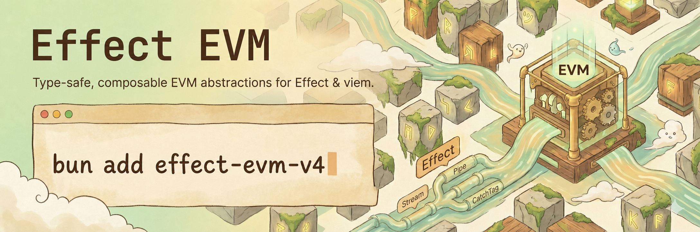

# effect-evm-v4

[](./LICENSE)
[](https://effect.website)
[](https://viem.sh)

> [!WARNING]
>
> This is experimental, beta software. It is provided "as is" without warranty of any kind, express or implied.

Type-safe, composable EVM abstractions for [Effect](https://effect.website), built on [viem](https://viem.sh).



## 📦 Installation

```bash
bun add effect-evm-v4
```

**Peer dependencies**

- `effect@^4.0.0-beta.102`
- `viem@^2.43`
- Optional: `@wagmi/core@>=2.0.0` (for `effect-evm-v4/wagmi`)
- Optional: `react@>=18.2.0`, `react-dom@>=18.2.0` (for `effect-evm-v4/react-hooks`)
- Optional: `vitest@>=4.1.0` (for assertion helpers in `effect-evm-v4/testing-kit`)

## 🚀 Usage

```typescript
import { Effect } from "effect";
import { mainnet } from "viem/chains";
import { ContractReader, erc20Abi, makeEffectEvmLayer, type ChainConfig } from "effect-evm-v4";

// 1. Configure chains
const configs: ChainConfig[] = [{ chainId: 1, chain: mainnet, rpcUrls: ["https://rpc.example"] }];

// 2. Create the layer
const EvmLayer = makeEffectEvmLayer(configs, window.ethereum);

// 3. Use services
const program = Effect.gen(function* () {
  const reader = yield* ContractReader;
  return yield* reader.read({
    chainId: 1,
    address: "0xA0b86991c6218b36c1d19D4a2e9Eb0cE3606eB48",
    abi: erc20Abi,
    functionName: "balanceOf",
    args: ["0x..."],
  });
});

// 4. Run
Effect.runPromise(program.pipe(Effect.provide(EvmLayer)));
```

## ✨ Features

- **Contracts** — `ContractReader` (multicall), `ContractWriter`, `ContractPipeline`, `typedContract`
- **Transactions** — `TxManager` with reactive state tracking
- **Events** — `EventStream`, `ReliableEventStream` (confirmations + reorg filtering)
- **Chain utilities** — `BalanceService`, `BlockService`, `GasService`, `NonceService`
- **Deploy + NFTs** — `DeployService`, `Erc721Service`
- **Signatures + simulation** — `SignatureService`, `SimulationService` (Tenderly)
- **Subscriptions** — `SubscriptionService` (blocks/logs/pending tx)
- **EIP-7702** — Delegation and atomic batching for EOAs
- **React hooks** — `effect-evm-v4/react-hooks` (primitives + convenience hooks)
- **Safe App + Safe multisig** — `useIsSafeAppContext`, `useIsHostSafeApp`, `useIsSafeMultisigWallet`
- **Wagmi integration** — `effect-evm-v4/wagmi` (build layers from wagmi config)
- **Browser persistence** — `browser` namespace (localStorage-backed stores)
- **Testing** — `effect-evm-v4/testing-kit` (mocks + `makeEffectEvmTestLayer`)

## ⚙️ Write Preflight Modes

`ContractPipeline.writeAndTrack` / `writeAndWait` now support per-call preflight strategy:

- `strict` (default): estimate + simulate, fail on either
- `best-effort`: continue on `GasEstimationError` / `SimulationFailedError`
- `none`: skip estimate/simulate and submit directly

`best-effort` only relaxes preflight; submission/receipt/decode errors still fail normally.

Recommended usage:

- Keep `strict` for create, batch, or high-cost writes.
- Consider `best-effort` for simple withdraw/claim flows.
- Use `none` only when your UX intentionally prefers wallet-first submission.

## 🧾 Terminal Outcomes

`ContractPipeline.writeAndWait` and `writeAndTrack(...).terminal` now return a terminal union:

- `{ _tag: "success", hash, receipt, events }`
- `{ _tag: "queued", reference?, reason?, details? }`
- `{ _tag: "cancelled", reference?, reason?, details? }`

Only operational errors (preflight/submission/receipt/decode) use `Effect.fail`.

## 📖 Documentation

- **Usage and examples**: [DOCS.md](./DOCS.md)
- **Development guidance**: [AGENTS.md](./AGENTS.md)

## Attribution

`effect-evm-v4` is a modified fork of [`@prb/effect-evm`](https://github.com/PaulRBerg/prb-effect/tree/main/evm),
originally created by [Paul Razvan Berg](https://github.com/PaulRBerg). This fork is maintained by
[hellowodl](https://github.com/hellowodl) and contains the Effect v4 port. It is not affiliated with or endorsed by the
original author.

See [NOTICE](./NOTICE) and [LICENSE](./LICENSE) for attribution and licensing details.

## 📄 License

[MIT](./LICENSE)
